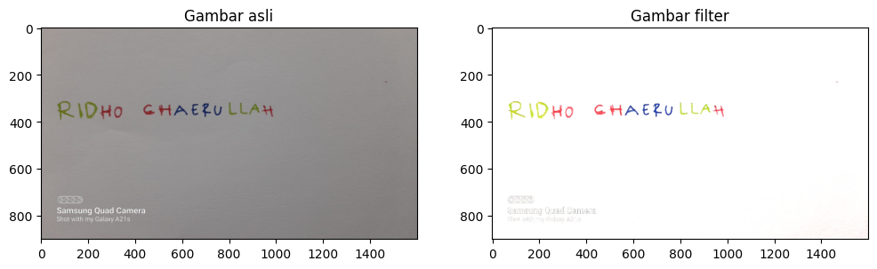
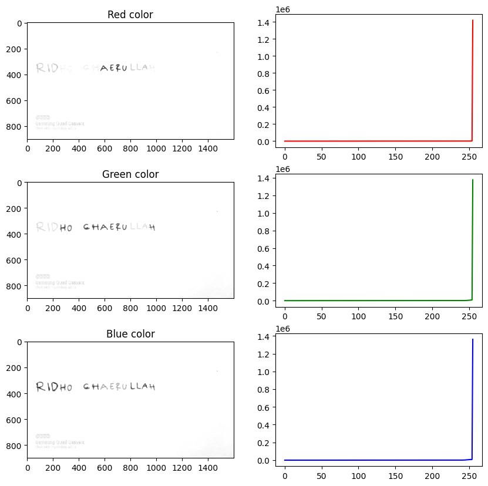
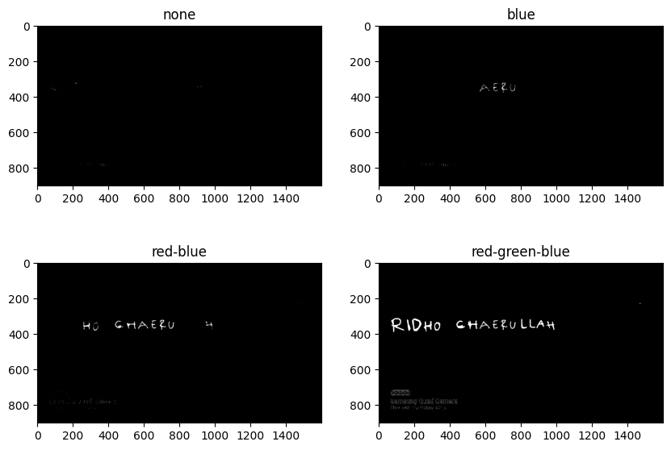

# Laporan UTS Pengolahan Citra Digital 

## Dikerjakan oleh: Ridho Chaerullah 202231122

### Menjelaskan tahapan cara menyelesaikan projek secara rinci (wajib)

1. Langkah pertama adalah saya import library dulu, library yang saya import adalah cv2, matplotlib.pyplot, dan numpy.
Pada saat aku mengimport librarynya aku juga mengaliaskan library yang sekiranya panjang dan akan memakan waktu untuk ku ketik, seperti matplotlib.pyplot dialiaskan dengan plt dan numpy dialiaskan dengan np.

2. Aku membaca gambar dan juga menginisialisasi kedalam variabel yang aku namai citra.
Gambar atau aset yang aku punya bernama dori.jpg.
Kemudian aku mengubah warna displaynya dari bgr ke rgb karena akan didisplay menggunakan pyplot.

3. Membuat variabel kernel yang berisi matriks untuk dimasukan kedalam filter yang akan berguna untuk meningkatkan perbedaan antara piksel tetangga.
Di tengah kernel terdapat angka 6, yang menyatakan bobot piksel pada posisi tersebut.
Angka negatif (-1) di sekitar angka 6 menunjukkan bahwa piksel di sekitarnya akan diberi bobot negatif.
Angka 0 menunjukkan bahwa piksel tersebut tidak diberi bobot.

4. Melakukan operasi pengolahan citra menggunakan filter kernel yang telah ditentukan sebelumnya menggunakan cv2.filter2D bagian dari fungsi OpenCV yang digunakan untuk menerapkan filter dua dimensi pada citra, dan aku menyinpan hasilnya di variabel citraOutput.
Aku langsung memplotkan dengan banyak kordinat matriks 1x2.
.ravel() berguna untuk ploting, karena yang bakal tampil itu kan satu dimensi ya buat histogramnya, jadi kira butuh .ravel().
Kemudian aku memplot pada kordinat yang aku inginkan dan memberikan title disetiap outputnya.

5. citraOutput[:,:,0] mengambil semua baris dan kolom dari saluran warna merah dari citra yang telah diproses.
Hasilnya adalah sebuah array dua dimensi yang berisi nilai intensitas piksel untuk saluran warna merah saja, begitu pula yang hijau dan merah.
Kemudian aku juga memplot hasil dari proses sebelumnya, dan aku ploting menggunakan histogram calHist, aku set titlenya juga dan memberikan warna untuk histogramnya sesuai dengan yang mereka outputkan.

6. Aku convert dari rgb ke gray untuk warna dari citraOutput karena dibutuhkan untuk threshold

7. aku plot sekaligus menentukan ambang batas atau threshold, untuk gray aku ambil 3, merah 50, hijau 100, dan 201 untuk biru.
Aku plot, memberikan title sesuai kodinat.

### Menjelaskan teori yang mendukung mengenai projek terkait (wajib)

1. `import cv2`: Modul OpenCV digunakan untuk pengolahan citra. Ini memberikan berbagai fungsi untuk membaca, memanipulasi, dan menyimpan citra.

`import matplotlib.pyplot as plt`: Modul matplotlib.pyplot digunakan untuk menampilkan gambar dan plot grafik. Di sini, kita akan menggunakan plt.imshow() untuk menampilkan gambar.

`import numpy as np`: Modul NumPy adalah pustaka Python yang berfokus pada manipulasi array dan matriks. Di sini, kita akan menggunakan NumPy untuk operasi-operasi matematika pada citra.

2. `cv2.imread("dori.jpg")`: Menggunakan fungsi imread() dari OpenCV untuk membaca gambar dengan nama "dori.jpg" ke dalam variabel citra.

`cv2.cvtColor(citra, cv2.COLOR_BGR2RGB)`: Menggunakan fungsi cvtColor() dari OpenCV untuk mengubah format warna citra dari BGR menjadi RGB.

3. Kernel adalah matriks kecil yang digunakan untuk operasi pemrosesan citra seperti filter, konvolusi, atau deteksi fitur.

Kernel ini adalah matriks berukuran 3x3 yang digunakan untuk meningkatkan ketajaman citra.
Angka 6 di tengah kernel menunjukkan bobot yang diberikan pada piksel di tengah kernel.
Angka negatif (-1) di sekitarnya menunjukkan bahwa piksel di sekitarnya akan diberi bobot negatif.
Angka 0 menunjukkan bahwa piksel tersebut tidak diberi bobot.

4. Kode `citraOutput = cv2.filter2D(citra, -1, kernel)` digunakan untuk menerapkan sebuah filter ke citra.

5. 
- `citraOutput[:,:,0]`: Ini memilih semua baris dan kolom untuk saluran warna merah dari citra yang telah diproses. Hasilnya adalah sebuah matriks dua dimensi yang berisi intensitas piksel untuk saluran warna merah saja.
- `citraOutput[:,:,1]`: Ini memilih semua baris dan kolom untuk saluran warna hijau dari citra yang telah diproses. Hasilnya adalah sebuah matriks dua dimensi yang berisi intensitas piksel untuk saluran warna hijau saja.
- `citraOutput[:,:,2]`: Ini memilih semua baris dan kolom untuk saluran warna biru dari citra yang telah diproses. Hasilnya adalah sebuah matriks dua dimensi yang berisi intensitas piksel untuk saluran warna biru saja.

6. `cv2.THRESH_BINARY` adalah jenis thresholding yang digunakan, di mana piksel yang melebihi nilai ambang akan diberi nilai maksimum (255) dan piksel lainnya akan diberi nilai minimum (0).

kenapa dalam kode saya itu ada yang 3, 50, 100, dan 201?

Angka-angka itu (3, 50, 100, dan 201) adalah nilai-nilai ambang (threshold) yang digunakan dalam proses thresholding. Nilai ambang ini menentukan bagaimana citra akan diubah menjadi citra biner.

Pemilihan nilai ambang ini tergantung pada karakteristik citra dan apa yang ingin dicapai dengan proses thresholding. Berikut adalah penjelasan teorinya:

3: Nilai ambang yang **sangat rendah**. Hal ini mungkin digunakan jika Anda ingin menyorot detail-detail kecil dalam citra, seperti tepi-tepi kecil atau detail-detail halus lainnya.

50: Nilai **ambang yang sedang**. Ini bisa digunakan untuk proses thresholding yang lebih umum, mungkin untuk memisahkan objek dari latar belakang dalam citra yang memiliki kontras yang cukup baik.

100: Nilai **ambang yang lebih tinggi**. Digunakan ketika Anda ingin lebih selektif dalam memilih objek yang akan dipisahkan dari latar belakang. Nilai ini bisa digunakan ketika kontras antara objek dan latar belakang lebih rendah.

201: Nilai **ambang yang sangat tinggi**. Digunakan ketika Anda ingin sangat selektif dalam memilih objek yang akan dipisahkan dari latar belakang. Nilai ini biasanya digunakan dalam situasi di mana kontras antara objek dan latar belakang sangat rendah.

7. 
Ini adalah output untuk hasil dari filter yang telah aku lakukan.

8. 
Ini adalah output untuk hasil pemisahan dimensi warna yang dilakukan sebelumnya, kenapa gambarnya itu hanya naik di 255? karena hanya ada 2 warna yaitu hitam atau putih, jadi antara 0 atau 255.

9. 
Ini adalah output untuk hasil dari thresholding.